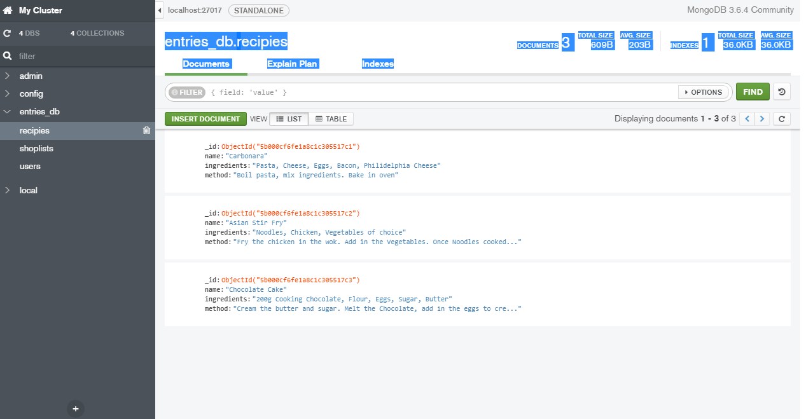

# Assignment 2 - ReactJS app.

Name: Phil Healy
Student number: 20079557
Assignment 2 

## Overview.

+ My own app concept
+ mongo db connection
+ 3 entities in the database
+ Header and footer Nav
+ Coded API tests 
+ Routing - 4 routes
+ Full manipulation of resources (Read/Write/Update/Delete)
+ User authentication 

Main concepts of the app is to add new recipes and view exisiting recipes.The app includes a list of the existing recipes with the ingredients and method attached. 

Across the navigation bar you will see differnt tabs including:

+login/sign up - To sign in or register as a user  -Persistance to DB

+Shopping List - Based on the recipe the user chooses they can then navigate to the Shopping list tab on the app. From there the user can insert the items in which they need to purchase for the chosen recipe. The user can also remove the items inserted one by one from the list.

+Reviews - any user can insert a comment/review based on any of the recipes. Each of the reviews can also be deleted. This component is not persisted to the DB. To do so I would follow the same process of the previous mongo integrations. 

Building on assignment one the main recipe index now has Mongo integration allowing full manipulation of resources (Create/read/update/delete). Each recipe contains an edit and delete option. Users can alter any recipe they wish and it will therefore be updated in the database. Deleting a recipe is also an option, and it will therefore be removed from the database.

As previously mentioned the app also contains an option to add a new recipe. The user simply, inputs the name, ingredients, and method. Following the submission of the new entry, 
an alert will pop up thanking you for entering the recipe with the name outlined also. Through the mongo integration every new entry will be insert into the recipies database

The same mongo integration applies for the shopping list - once item added, shoplist data base is updated with new entry. Same applies for delete. Database will be updated and item removed. 

...... A statement of the app concept and objectives (about a half-page) ........

 . . . . . List of user features (excluding user registration and authentication) . . . .

+ Insert input form -add new recipe
+ Footer navigation - to the top of the page
+ Edit feature - Edit and update aspects of the recipe 
+ Delete - Remove a recipe from the list
+ Shopping list - create a shopping list of items required for the users choice
+ Remove - Independently remove each of the items from the shopping list 
+ Review section - add a review/comment in regards to any of the recipes 
+ Remove - Independently remove each of the reviews
+ Mongo Integration with full manipulation resources 
+ Implemented a server side version using Mongo db and primed the recipe Entity with test data
+ Implemented components using express, babel, mongoose, elint, router etc. 

## Installation requirements.
. . . .  List of software used to develop the app . . . . . . .
+ ReactJS v15.3.0
+ Bootstrap 3
+ Create-react-app my-app
+ Npm install - node modules
+ Run build 
+ npm install  bootstrap@3.3.6  --save
+ npm install -g httpserver
+ npm install  lodash@2.4.2 --save
+ npm install react-router-dom@4.2.2 --save
+ npm install  superagent@1.6.1 --save
+ git & configuration 
+ npm install --save-dev babel-cli
+ npm install --save-dev babel-preset-env
+ npm install --save express
+ npm install --save-dev eslint babel-eslint
+ npm install dotenv --save
+ npm install -save mongoose
+ npm install --save-dev nodemon
+ npm install -save express-async-handler
+ npm install cors
+ npm install 
+ npm install --save axios
+ npm install --save react-signup-login-component
+ npm install --save body-parser
+ npm install --save lodash
+ npm install --save-dev mocha
+ npm install --save-dev should
+ npm install --save-dev supertest
+ npm install --save-dev babel-core
+ npm install --save-dev babel-polyfill
+ npm install save-dev cross-env
+ npm install --save-dev mochawesome

When cloning the app from my repository, you simply just need to run npm start on the client
To initialise the server - in the server folder run npm start
To intialise the data base - locate the mongoDB file > /server/3.6/bin and run mongod

## Data Model Design.

Diagram of app's data model (see example below) AND/OR a sample of the test data used (JSON or equivalent).

Use meaningful sample data. Briefly explain any non-trivial issues.

## App Component Design.

A diagram showing the app's hierarchical component design (see example below).

![][image2]

## UI Design.

. . . . . Screenshots of app's views (see example below) with appropriate captions (user regeneration and login views, if implemented, can be omitted) . . . . . . .

![][image3]

## Routing.
. . . . List each route supported and state the associated view . . . . .

+ /foos - displays all published foos
+ /foos/:id - detail view of a particular foo (:id)
+ etc
+ etc

# Web API Endpoint Reference
. . . Give a brief overview of the Web API functionality.

## Web API Install and Operation
. . . . Describe how to install/start/stop the API. It would be a good idea to go though the scripts section of the package.json file.

## API Design
Describe your web API.

| HTTP Verb & Path |  Description |
| -- | -- |
| GET: /api/contacts |return a list of contacts |
| POST: /api/contacts |add a new contact |
| PUT: /posts/api/contacts/:id | update a contact |
| DELETE: /posts/api/contacts/:id | delete a contact |

## API Configuration
Describe the configuration approach for your endpoint. For example, contents of config file and where it should be located:
~~~bash
NODE_ENV=development
PORT=8080
HOST=localhost
mongoDB=YourMongoURL
seedDb=true
secret=YourJWTSecret
~~~

## Security and Authentication
. . . . Give details of any autentication/security implemented in on the API. Indicate which routes are protected.

## Testing
. . . . Briefly explain any testing strategy that accompanies the project, including and example report if you have one...
![][image4]

## Extra features

. . . . . Briefly explain any non-standard features, functional or non-functional (e.g. user registration, authentication) developed for the app . . . . . .  

## Independent learning.

. . . . . State the non-standard aspects of React/Express/Node (or other related technologies) that you researched and applied in this assignment . . . . .  

[image1]: ./model.png
[image2]: ./design.jpg
[image3]: ./screen.png
[image4]: ./testing.png
