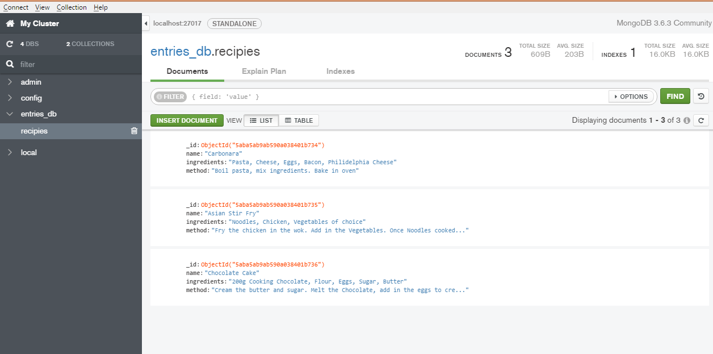
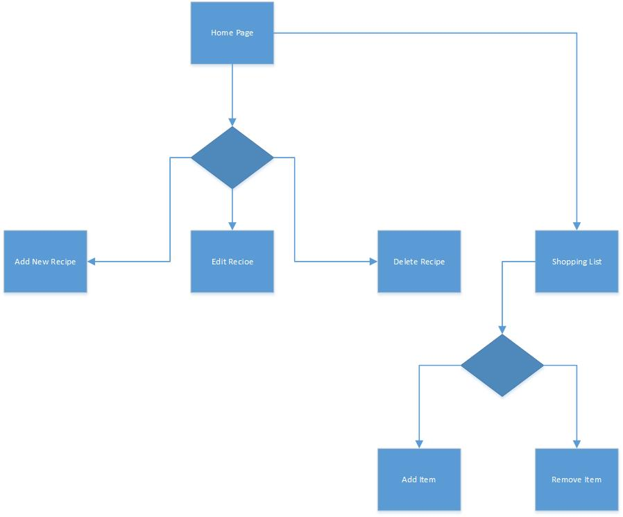
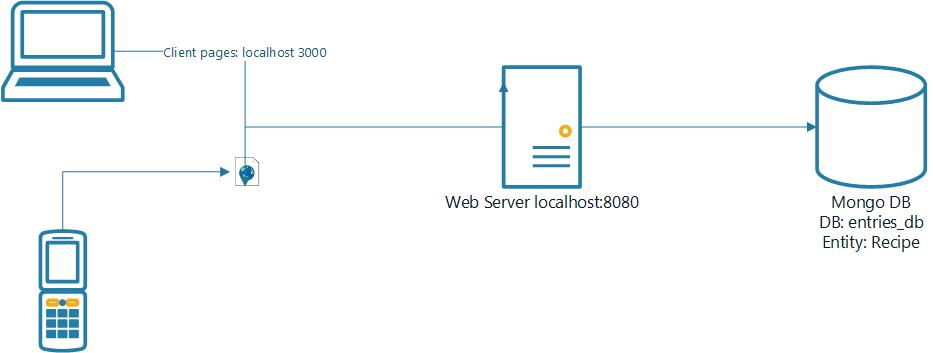

# Assignment 1 - ReactJS app.

Name: Phil Healy
Student Numeber: 20079557
App Name: project/my-app (A Recipe app)

## Overview.
Note: Due to time constraints and learning curve for me I was not able to combine some of the implementation features for this project.
However I attempted and partially/fully implemented all aspects including:
+ My own app concept
+ Seperate server instance with one Entity and mongo db connection
+ Attempted routing with header,footer and main area
+ Coded search functionality
+ Header and footer nav

Main concepts of the app is to add new recipes and view exisiting recipes. 
The app includes a list of the existing recipes with the ingredients and method attached. Based on the recipe the user chooses they can then navigate to the Shopping list tab on the app (Note I could not get the Link To working so it will not load from the home page. I have attached screen shots to show it working seperately)
From there the user can insert the items in which they need to purchase for the chosen recipe. The user can also remove the items inserted one by one from the list.

The main recipe index contains an edit and delete option. Users can alter any recipe they wish and it will therefore be updated. Deleting a recipe is also an option.

As previously mentioned the app also contains an option to add a new recipe. The user simply, inputs the name, ingredients, and method. Following the submission of the new entry, 
an alert will pop up thanking you for entering the recipe with the name outlined also. 

 List of user features (excluding user registration and authentication) . . . . 
 
+ Insert input form -add new recipe
+ Footer navigation - to the top of the page
+ Edit feature - Edit and update aspects of the recipe 
+ Delete - Remove a recipe from the list
+ Shopping list - create a shopping list of items required for the users choice
+ Remove - Independently remove each of the items from the shopping list 
+ Implemented a server side version using Mongo db and primed the recipe Entity with test data
+ Implemented components using express, babel, mongoose, elint, router etc. 

Code layout:
+my-app
  +src
    +component
      +shoppinglist (npm start will run this as a seperate app as I could not get the links working, not ideal but a work around)
    +server (npm start invokes this server running on 8080)
    +node modules
    +public

## Installation requirements.
. . . .  List of software used to develop the app . . . . . . . 
+ ReactJS v15.3.0
+ Bootstrap 3
+ create-react-app tool

Installations:
+ Create-react-app my-app
+ Npm install - node modules
+ Run build 
+ npm install  bootstrap@3.3.6  --save
+ npm install -g httpserver
+ npm install  lodash@2.4.2 --save
+ npm install react-router-dom@4.2.2 --save
+ npm install  superagent@1.6.1 --save
+ git & configuration 
+ npm install --save-dev babel-cli
+ npm install --save-dev babel-preset-env
+ npm install --save express
+ npm install --save-dev eslint babel-eslint
+ npm install dotenv --save
+ npm install -save mongoose
+ npm install -save express-async-handler

When cloning the app from my repository, you simply just need to run npm start 

## Data Model Design.

Diagram of app's data model (see example below)

Given more time I would modified my client app to call via a REST api get service call to retrieve the recipe data. I would also have impemented update, edit and insert functionality. The code is partially developed to allow this.

## App Component Design.

Below is a high level over of my app components

## UI Design.

The app has a simple 2 page design
>Add recipe - which allows for viewing and editing existing recipes
>Shopping list - which allows the user to make and persist a shopping list (Note I would have implemented an additional entity for this given the time)

## Routing.
. . . . List each route supported and state the associated view . . . . . 

+ /header - displays linkss
+ /recipies/:id - detail view of a particular recipie (:id)
+ /footer - displays author info

## Independent learning.

Alot of this is brand new technology to me and involved alot of additional hours learning and investigation

+ Implementation of different react aspects within the app
+ Implementing mongoose and incorporating it into the app
+ UI & Css designs